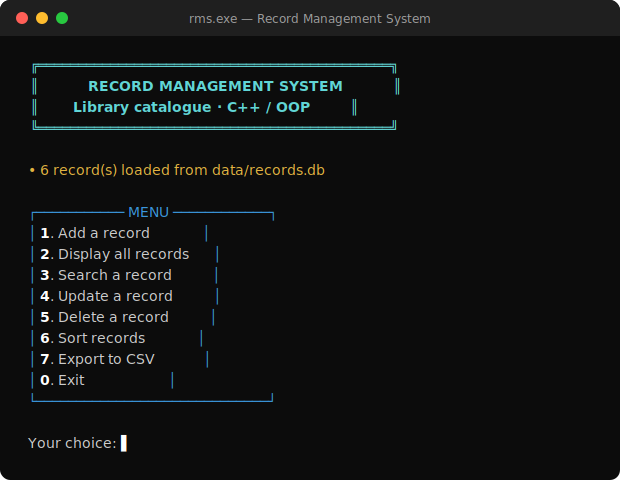
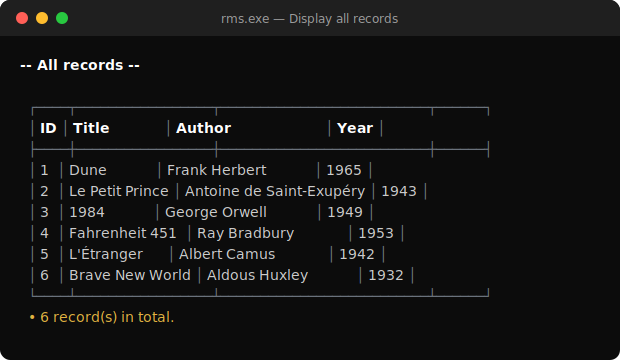
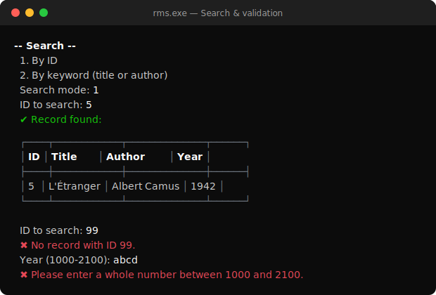
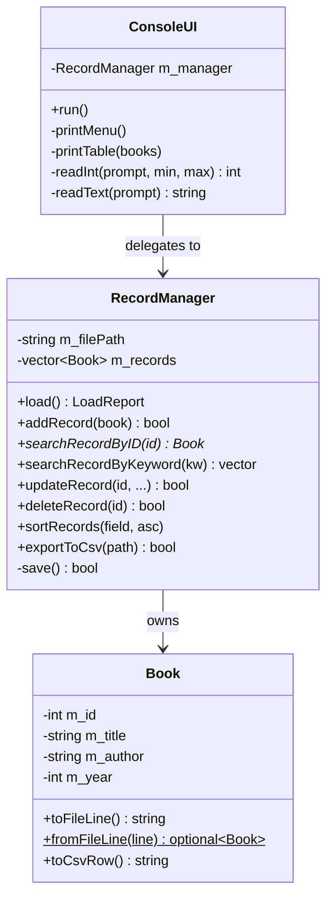

# 📚 Record Management System

A file-based **library catalogue** written in modern **C++ (OOP)**: add, list, search, update, delete, sort and export book records from a clean, colorful, menu-driven command line interface. Every change is saved to disk immediately, so nothing is ever lost.


## Screenshots

| Main menu | All records |
|:---:|:---:|
|  |  |

<p align="center">
  
</p>

## ✨ Features

- **Add a record** — ID (auto-suggested), title, author, year; saved to file instantly
- **Display all records** — aligned Unicode table, UTF-8 accents handled
- **Search** — by exact ID *or* by keyword on title/author (case-insensitive); "not found" handled gracefully
- **Update a record** — pick an ID, edit each field in place (press Enter to keep the current value)
- **Delete a record** — shows the record first and asks for confirmation
- **Sort** — by ID, title, author or year, ascending or descending, persisted to file
- **Export to CSV** — RFC 4180 compliant (commas and quotes properly escaped), opens directly in Excel
- **Error handling & validation** — rejects non-numeric input, out-of-range years (1000–2100), empty fields, duplicate IDs, the reserved `|` character, and silently skips corrupt lines in the data file

## 🏛️ Architecture (OOP)

The code is split into three classes with a single responsibility each:



| Class | Responsibility |
|---|---|
| [`Book`](src/Book.h) | The record itself + its serialization (file line, CSV row) |
| [`RecordManager`](src/RecordManager.h) | Business logic: CRUD, sorting, CSV export, file persistence |
| [`ConsoleUI`](src/ConsoleUI.h) | Menu loop, colored rendering, input reading & validation |

## 🚀 Getting started

### Prerequisites

A C++17 compiler — `g++` 9 or newer (MinGW-w64 on Windows, GCC/Clang on Linux/macOS).

> On Windows you can install it with: `winget install BrechtSanders.WinLibs.POSIX.UCRT`

### Build & run

**Windows**

```bat
build.bat
rms.exe
```

**Linux / macOS (or Windows with make)**

```sh
make
./rms
```

The program creates `data/records.db` automatically on first save. A small sample catalogue is included so you can explore right away.

## 🕹️ Usage

```
  ┌─────────── MENU ────────────┐
  │ 1. Add a record             │
  │ 2. Display all records      │
  │ 3. Search a record          │
  │ 4. Update a record          │
  │ 5. Delete a record          │
  │ 6. Sort records             │
  │ 7. Export to CSV            │
  │ 0. Exit                     │
  └─────────────────────────────┘
```

Type the number of an action and follow the prompts. Invalid input is never fatal — the program explains what it expects and asks again.

## 💾 Data storage

Records live in `data/records.db`, one pipe-delimited line per record:

```
1|Dune|Frank Herbert|1965
2|Le Petit Prince|Antoine de Saint-Exupéry|1943
```

The CSV export (`data/records.csv` by default) adds a header row and proper quoting:

```csv
ID,Title,Author,Year
1,Dune,Frank Herbert,1965
2,Le Petit Prince,Antoine de Saint-Exupéry,1943
```

## 🧪 Testing

All features were exercised end-to-end with scripted input sessions:

- ✅ Add / display / search (found & not found) / update / delete (confirm & cancel)
- ✅ Sorting by every field, both directions, order persisted
- ✅ CSV export, including titles containing commas and quotes
- ✅ Validation: non-numeric input, out-of-range years, empty fields, duplicate IDs, `|` rejection
- ✅ Corrupt lines in the data file are reported and skipped
- ✅ Data survives program restarts (reloaded from file on startup)

## 📁 Project structure

```
Record-Management-System/
├── src/
│   ├── main.cpp            # entry point
│   ├── Book.h / .cpp       # the record + serialization
│   ├── RecordManager.h / .cpp  # CRUD, sort, CSV, persistence
│   └── ConsoleUI.h / .cpp  # menu, rendering, input validation
├── data/
│   └── records.db          # sample catalogue (auto-created if missing)
├── docs/                   # screenshots
├── Makefile                # make / make run / make clean
├── build.bat               # one-click Windows build
└── README.md
```
